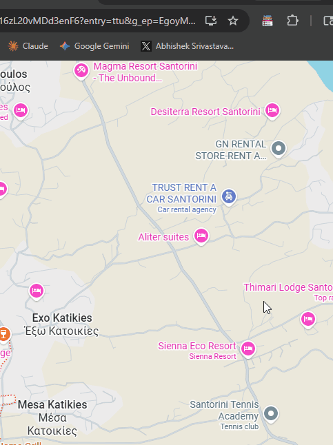

# 📒 Tab Ledger

> **Day 01 / 180 — 180 Days of Building**

AI logs your browser session — scores your important tabs, summarizes what matters, and saves a record you can restore anytime.

---

## What it does

Most tab managers just list your tabs. Tab Ledger **understands** them.

- **Scores every tab** by recency, pinned status, domain type, and activity
- **Reads the top 5 important tabs** using content extraction
- **Generates a session report** — what you're working on, per-tab summaries, health breakdown, action list
- **Auto-saves the session** as "Tabs for the day" to your Sessions panel
- **Restore anytime** — even after closing the browser, reopen all tabs + view the full summary in a dedicated page
- **Rename sessions** inline — click the title to edit

---

## Features

| Feature | Details |
|---------|---------|
| 🎯 Focus detection | Identifies your main task from tab patterns |
| 📌 Smart summaries | Extracts and summarizes page content from important tabs |
| 📊 Session health | Active work vs. research vs. distraction breakdown |
| ✅ Action list | Specific tabs to close, save, or keep |
| 💾 Session history | Up to 30 sessions saved locally |
| ↩ Restore | Reopens all tabs + launches a full summary page |
| ✏️ Rename | Click any session name to rename it |

---

## Setup

### 1. Load the extension
1. Go to `chrome://extensions`
2. Enable **Developer mode** (top right)
3. Click **Load unpacked** → select the `tab-ledger` folder

### 2. Add your API key
Click **⚙** in the extension popup and paste either:

- **Gemini API key** — free at [aistudio.google.com](https://aistudio.google.com)
- **OpenRouter key** — free tier at [openrouter.ai](https://openrouter.ai) (fallback if Gemini quota hits)

---

## How to use

1. Click the extension icon
2. Hit **📒 Log Session**
3. Wait ~10 seconds for Phase 1 (quick focus check) → Phase 2 (full report)
4. Session auto-saves — check the **Sessions** tab to view or restore it later

---

## Tech stack

- Chrome Extension Manifest V3
- Gemini 2.0 Flash (primary) → OpenRouter fallback
- Vanilla JS — no frameworks, no build step

---

## Part of 180 Days of Building

I'm shipping one AI tool every day for 180 days.

Follow along: [@happy_ships](https://x.com/happy_ships)

---

*Built with Gemini API × Chrome Extensions*
